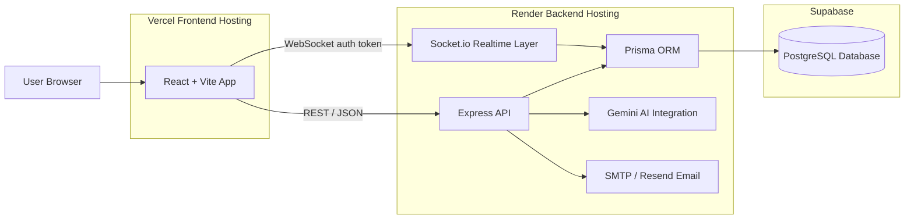
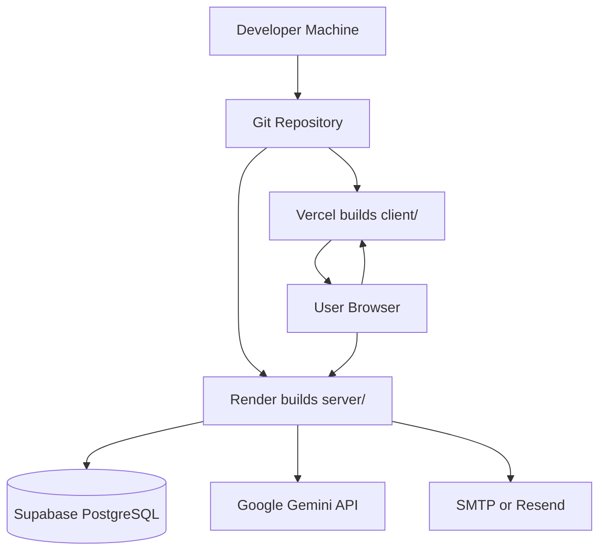

# WorkWise Architecture

WorkWise is a split frontend/backend application. The React/Vite client runs in the browser and communicates with an Express API over HTTPS. The backend owns authentication, authorization, business logic, database access through Prisma, Gemini AI calls, email delivery, and Socket.io realtime events.

## High-Level Diagram

The same diagram is also available as [architecture-diagram.mmd](architecture-diagram.mmd).

## Runtime Components

| Component | Responsibility |
| --- | --- |
| React/Vite frontend | Renders the product UI, handles routing, stores auth tokens client-side, calls REST APIs, and connects to Socket.io. |
| Express backend | Exposes REST endpoints for auth, projects, tasks, sprints, documents, activity, notifications, users, and AI. |
| Prisma ORM | Provides typed database access and migration management for PostgreSQL. |
| PostgreSQL/Supabase | Stores users, projects, memberships, sprints, tasks, comments, documents, notifications, activity, digests, and retrospectives. |
| Gemini AI integration | Generates task breakdowns, acceptance criteria, daily digests, and sprint retrospectives. |
| Socket.io realtime layer | Authenticates sockets with JWTs, joins project rooms, and emits project/user events. |
| Vercel | Hosts the static frontend bundle and supports SPA rewrites. |
| Render | Hosts the long-running Node/Express API and Socket.io server. |

## Request Flow

1. A user loads the Vercel-hosted React app.
2. The frontend calls the Render backend using `VITE_API_BASE_URL`.
3. Public auth routes issue JWT access and refresh tokens.
4. Protected API calls include `Authorization: Bearer <accessToken>`.
5. Express validates the request and checks project membership or role where needed.
6. Services use Prisma to read and write PostgreSQL data.
7. When a change should be realtime, backend services emit Socket.io events to project or user rooms.
8. AI features call Gemini from the backend only; Gemini credentials are never exposed to the browser.

## Realtime Flow

1. The client opens a Socket.io connection to the backend with `auth.token`.
2. The server verifies the JWT and joins the socket to `user:<userId>`.
3. The client emits `project:join` with a project ID.
4. The server verifies project membership through Prisma.
5. If authorized, the socket joins `project:<projectId>`.
6. Backend services emit project events to project rooms and notification events to user rooms.

## Data Model Summary

Core Prisma models:

- `User`: account, profile, onboarding, and notification preference data.
- `Project`: workspace container with unique project key.
- `ProjectMember`: user/project membership with `ADMIN`, `DEVELOPER`, or `VIEWER` role.
- `Invitation`: pending, accepted, or declined project invitations.
- `Sprint`: sprint metadata and active state.
- `Task`: backlog and board item with status, priority, labels, due date, assignment, sprint, and creator.
- `Comment`: task discussion entries.
- `Document`: project documentation pages.
- `TaskDocument` and `SprintDocument`: linking tables for documentation references.
- `Notification`: user notification center entries.
- `ProjectActivity` and `TaskActivity`: audit/activity feed records.
- `DailyDigest`: generated AI digest summaries.
- `SprintRetrospective`: generated AI retrospective reports and manual notes.

## Security Boundaries

- Browser code receives only `VITE_` variables.
- JWT secrets, database URLs, SMTP credentials, and Gemini API keys stay on the backend.
- Backend CORS is restricted to `FRONTEND_URL`.
- Project routes require authentication and service-level membership checks.
- Admin-only operations are enforced for sensitive project actions such as project updates, deletion, invitations, role updates, and sprint administration.

## Deployment Topology

## Operational Notes

- Use `npx prisma migrate deploy` for production migrations.
- Use `npx prisma generate` during backend builds and after schema changes.
- Render must run as a persistent web service so Socket.io can maintain connections.
- Vercel must build from `client/` and use the SPA rewrite in `client/vercel.json`.
- Production `FRONTEND_URL` and `VITE_API_BASE_URL` must reference each other correctly.
